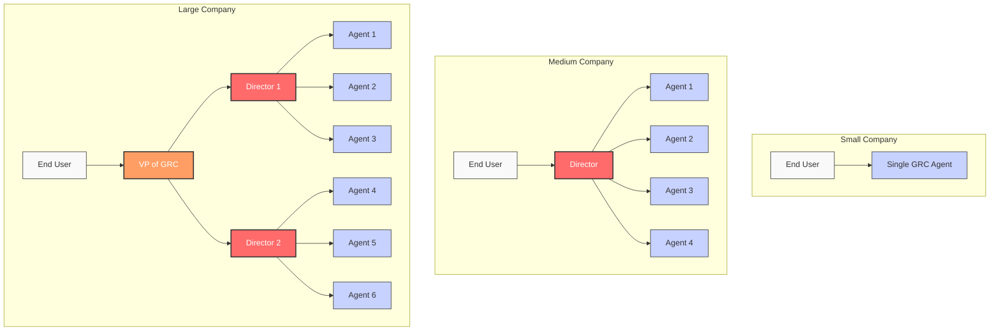
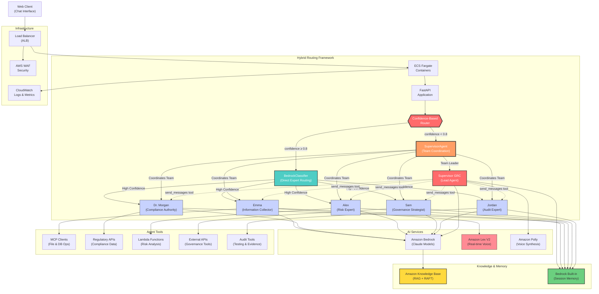

# GRC Agent Squad
## Intelligent Voice-Enabled AI Specialists for Governance, Risk & Compliance

---

# Our Solution: Create Your own GRC Squad

An **agentic framework** that simulates how organizations manage complex GRC tasks through intelligent delegation:
- **Layered Architecture**: Supervisor agent orchestrates complex multi-step operations by delegating to specialist agents
- **Intelligent Task Delegation**: Classifier analyzes requests and breaks them into subtasks for appropriate expert agents
- **Agentic Tool Ecosystem**: Agents can call APIs, Lambda functions, MCP clients, and even other agents as tools
- **Autonomous Agent Tools**: Each agent is both a specialist and a tool that can be used by other agents
- **Modular Agent Construction**: Agents can be constructed from a set of tools, use cases and capabilities

---

# GRC Squad Configurations for Different Company Sizes

- **Small Companies**: 1-2 agents with versatile use cases
- **Medium Companies**: 5-6 agents with orchestration and complex use cases
- **Large Companies**: 10+ agents with layered structure, multilevel delegation

---

# Meet The Squad

**🎯 SupervisorAgent**: Hybrid team leader that coordinates complex cases by orchestrating parallel communication between specialist agents

**🔄 Confidence-Based Routing**: High confidence requests go directly to experts, low confidence/complex requests use supervisor coordination

- **Emma**: Information Collector - Empathetic interviewer conducting audit interviews, stakeholder consultations, and compliance information gathering
- **Dr. Morgan**: Compliance Authority - Official compliance agent providing definitive regulatory guidance and formal documentation
- **Alex**: Risk Analysis Expert - Analytical specialist in risk assessment, analysis, and mitigation strategies
- **Sam**: Governance Strategist - Strategic specialist focused on governance frameworks, policy development, and board-level guidance
- **Jordan**: Audit Expert - Internal audit specialist *(In Development - Not Yet Implemented)*

---

# Key Capabilities

- **Hybrid Routing**: Confidence threshold (0.8) determines direct expert access vs supervisor coordination
- **Parallel Coordination**: SupervisorAgent can communicate with multiple team members simultaneously
- **RAG-Enhanced Intelligence**: Amazon Knowledge Base Retriever with RAFT fine-tuning capability
- **Multi-Modal Interaction**: Rich text chat, voice synthesis (Polly NTTS), and real-time voice (Lex V2)
- **Tool Ecosystem**: MCP clients, API calls, Lambda functions, and external service integrations
- **Context Continuity**: Bedrock built-in memory maintains complex workflow state across interactions

---

# Use Cases: Complex Orchestration

**Multi-Step Risk Assessment Workflow** (Low Confidence → Supervisor):
1. User: "Assess our cloud migration risks and create a mitigation plan"
2. Classifier confidence < 0.8 → Routes to SupervisorAgent
3. Supervisor coordinates: Emma interviews stakeholders || Alex analyzes risks || Morgan reviews compliance || Sam designs governance
4. Supervisor synthesizes responses into comprehensive plan

**Parallel Team Coordination**:
- SupervisorAgent uses `send_messages` tool for simultaneous agent communication
- Team members work independently while supervisor maintains coordination
- RAG provides domain knowledge, tools provide external data and actions

---

# Use Cases: Simple Requests

**Direct Expert Routing (High Confidence ≥ 0.8)**:
- **"What are GDPR data retention requirements?"** → Direct to Dr. Morgan (Compliance)
- **"Schedule an interview with our CISO"** → Direct to Emma (Information Collector) 
- **"What's our current risk exposure?"** → Direct to Alex (Risk Expert)
- **"Review board committee structure"** → Direct to Sam (Governance)
- **"Conduct SOC 2 internal audit"** → Direct to Jordan (Audit Expert)

**Tool Integration Examples**:
- Emma uses Lex V2 for real-time voice interviews
- Alex calls risk assessment APIs and Lambda functions
- Morgan queries regulatory databases via MCP clients
- Sam analyzes governance documents using RAG retrieval
- Jordan executes audit procedures and compliance testing

---

# Hybrid Tool Ecosystem

**SupervisorAgent Communication**:
- `send_messages` tool enables parallel agent coordination
- SupervisorAgent orchestrates complex multi-agent workflows
- Dynamic routing based on confidence thresholds

**External Tool Integration**:
- **MCP Clients**: File operations, database queries, document analysis
- **API Calls**: Regulatory databases, compliance systems, GRC platforms  
- **Lambda Functions**: Custom business logic, data processing, integrations
- **Lex V2**: Real-time voice interactions for interviews

**Context Enhancement**:
- **RAG (Knowledge Base)**: Domain-specific GRC knowledge with RAFT fine-tuning
- **Bedrock Memory**: Built-in session memory for conversation continuity
- **System Prompts**: Agent personality and capability definitions

---

# Voice & Interaction Capabilities

**Current Implementation**:
- **Voice Synthesis**: Amazon Polly Neural TTS for agent responses
- **Text-Based Chat**: Primary interaction with rich markdown support
- **Conversation Memory**: Bedrock built-in memory for session continuity

**Advanced Voice Features** (In Development):
- **Real-Time Voice Interviews**: Emma agent with Lex V2 integration
- **Bidirectional Voice**: Full speech-to-text and text-to-speech pipeline
- **Voice-Guided Workflows**: SupervisorAgent-led voice orchestration

**Multi-Modal Experience**:
- Text, voice, and hybrid interactions based on use case
- Agent-specific voice and response styles
- Context-aware interaction mode selection

---

# Architecture

- **Hybrid Framework**: Confidence-based routing between direct expert access and supervisor coordination
- **SupervisorAgent**: Team leader orchestrates complex cases with parallel agent communication
- **Tool Ecosystem**: Agents as tools, MCP clients, APIs, Lambda functions
- **RAG Architecture**: Knowledge Base Retriever with RAFT fine-tuning  
- **Built-in Memory**: Bedrock session memory for conversation continuity

---

# Development Roadmap

**Phase 1: Hybrid Framework (Current PoC)** ✓
- SupervisorAgent-led orchestration with confidence-based routing
- Parallel agent communication and tool integration
- Basic voice synthesis (Polly NTTS)
- Bedrock built-in memory for session management

**Phase 2: Enhanced Tool Ecosystem** 🚧
- RAG implementation with Amazon Knowledge Base Retriever
- RAFT fine-tuning capabilities for domain-specific knowledge
- Expanded MCP client integrations and external API tools
- Lambda function integration for custom business logic

**Phase 3: Advanced Voice & Real-Time Features** 📋
- Emma agent with full Lex V2 integration for voice interviews
- Bidirectional voice processing with Amazon Transcribe
- Real-time conversation flows and SupervisorAgent voice orchestration
- Multi-modal interaction coordination

**Future: Enterprise & Production** 🏢
- Production-scale deployment and monitoring
- Advanced agent collaboration patterns
- Custom agent development framework
- Enterprise integration and security hardening

---

# Summary

- **Hybrid Intelligence**: Confidence-based routing between direct expert access and supervisor coordination
- **Parallel Coordination**: SupervisorAgent orchestrates complex workflows with simultaneous team communication
- **Knowledge Enhancement**: RAG with RAFT fine-tuning provides continuously improving domain expertise
- **Tool Flexibility**: Extensible architecture supports MCP clients, APIs, Lambda functions, and custom integrations
- **Context Continuity**: Bedrock built-in memory maintains workflow state across complex multi-session operations
- **Adaptive Interaction**: Smart routing (≥0.8 confidence) between simple direct responses and complex orchestrated workflows

---

# 👍 Thank You 👍

