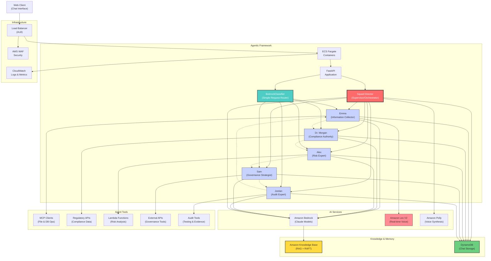

# GRC Agent Squad
## Intelligent Voice-Enabled AI Specialists for Governance, Risk & Compliance

---

# The Challenge

- **Complex Regulatory Environment**: Increasing regulations requiring specialized knowledge
- **Time-Intensive Processes**: Manual audit interviews, compliance assessments, and risk evaluations
- **Expertise Gaps**: Difficult to maintain in-house expertise across all GRC domains
- **Documentation Burden**: Extensive requirements for audit trails and compliance evidence
- **Inconsistent Approaches**: Variation in how GRC processes are executed across organizations

---

# Our Solution: GRC Agent Squad

An **agentic framework** that simulates how organizations manage complex GRC tasks through intelligent delegation:

- **Director-Led Architecture**: Squad Director orchestrates complex multi-step operations by delegating to specialist agents
- **Intelligent Task Delegation**: Director analyzes requests and breaks them into subtasks for appropriate expert agents
- **Agentic Tool Ecosystem**: Agents can call APIs, Lambda functions, MCP clients, and even other agents as tools
- **RAG-Enhanced Context**: Amazon Knowledge Base Retriever provides domain-specific knowledge with RAFT capability
- **Autonomous Agent Tools**: Each agent is both a specialist and a tool that can be used by other agents
- **Conversation Continuity**: DynamoDB chat storage with built-in session memory for complex workflows

---

# Meet The Squad

**🎯 Director (Supervisor)**: High-level supervisor orchestrating complex tasks by breaking them into subtasks and delegating to specialist agents

**🔄 Intelligent Routing**: Direct classifier bypass for simple requests, Director orchestration for complex workflows

- **Emma**: Information Collector - Empathetic interviewer conducting audit interviews, stakeholder consultations, and compliance information gathering
- **Dr. Morgan**: Compliance Authority - Official compliance agent providing definitive regulatory guidance and formal documentation
- **Alex**: Risk Analysis Expert - Analytical specialist in risk assessment, analysis, and mitigation strategies
- **Sam**: Governance Strategist - Strategic specialist focused on governance frameworks, policy development, and board-level guidance
- **Jordan**: Audit Expert - Internal audit specialist *(In Development - Not Yet Implemented)*

---

# Key Capabilities

- **Agentic Framework**: Director-led task delegation with autonomous agent-to-agent communication
- **Agents as Tools**: Each specialist can be invoked as a tool by other agents or the Director
- **RAG-Enhanced Intelligence**: Amazon Knowledge Base Retriever with RAFT fine-tuning capability
- **Multi-Modal Interaction**: Text chat, voice synthesis (Polly NTTS), and real-time voice (Lex V2)
- **Tool Ecosystem**: MCP clients, API calls, Lambda functions, and external service integrations
- **Context Continuity**: DynamoDB chat storage maintains complex workflow state across interactions
- **Dynamic Orchestration**: Smart routing - simple requests bypass Director, complex ones get full orchestration

---

# Use Cases: Complex Orchestration

**Multi-Step Risk Assessment Workflow**:
1. Director receives: "Assess our cloud migration risks and create a mitigation plan"
2. Director delegates: Information gathering → Risk analysis → Control recommendations → Documentation
3. Emma interviews stakeholders → Alex analyzes risks → Morgan reviews compliance → Sam designs governance → Jordan audits controls

**Autonomous Agent Collaboration**:
- Agents call each other as tools during complex workflows
- Director maintains oversight while agents work independently
- RAG provides domain knowledge, tools provide external data and actions

---

# Use Cases: Simple Requests

**Direct Agent Routing (Classifier Bypass)**:
- **"What are GDPR data retention requirements?"** → Direct to Dr. Morgan (Compliance)
- **"Schedule an interview with our CISO"** → Direct to Emma (Information Collector) 
- **"What's our current risk exposure?"** → Direct to Alex (Risk Expert)
- **"Review board committee structure"** → Direct to Sam (Governance)
- **"Conduct SOC 2 internal audit"** → Direct to Jordan (Audit Expert)

**Tool Integration Examples**:
- Emma uses Lex V2 for real-time voice interviews
- Alex calls risk assessment APIs and Lambda functions
- Morgan queries regulatory databases via MCP clients
- Sam analyzes governance documents using RAG retrieval
- Jordan executes audit procedures and compliance testing

---

# Agentic Tool Ecosystem

**Agent-to-Agent Communication**:
- Agents invoke other agents as tools in workflows
- Director orchestrates while enabling autonomous collaboration
- Dynamic tool selection based on capabilities

**External Tool Integration**:
- **MCP Clients**: File operations, database queries, document analysis
- **API Calls**: Regulatory databases, compliance systems, GRC platforms  
- **Lambda Functions**: Custom business logic, data processing, integrations
- **Lex V2**: Real-time voice interactions for interviews

**Context Enhancement**:
- **RAG (Knowledge Base)**: Domain-specific GRC knowledge with RAFT fine-tuning
- **DynamoDB Storage**: Persistent conversation state for multi-session workflows
- **System Prompts**: Agent personality and capability definitions

---

# Voice & Interaction Capabilities

**Current Implementation**:
- **Voice Synthesis**: Amazon Polly Neural TTS for agent responses
- **Text-Based Chat**: Primary interaction with rich markdown support
- **Conversation Memory**: DynamoDB storage for session continuity

**Advanced Voice Features** (In Development):
- **Real-Time Voice Interviews**: Emma agent with Lex V2 integration
- **Bidirectional Voice**: Full speech-to-text and text-to-speech pipeline
- **Voice-Guided Workflows**: Director-led voice orchestration

**Multi-Modal Experience**:
- Text, voice, and hybrid interactions based on use case
- Agent-specific voice personalities and response styles
- Context-aware interaction mode selection

---

# Architecture

- **Agentic Framework**: Director-led orchestration with agent collaboration
- **Tool Ecosystem**: Agents as tools, MCP clients, APIs, Lambda functions
- **RAG Architecture**: Knowledge Base Retriever with RAFT fine-tuning  
- **Persistent Memory**: DynamoDB chat storage for workflow continuity

---

# Development Roadmap

**Phase 1: Agentic Framework (Current PoC)** ✓
- Director-led orchestration with classifier bypass
- Agent-to-agent communication and tool integration
- Basic voice synthesis (Polly NTTS)
- DynamoDB chat storage and session management

**Phase 2: Enhanced Tool Ecosystem** 🚧
- RAG implementation with Amazon Knowledge Base Retriever
- RAFT fine-tuning capabilities for domain-specific knowledge
- Expanded MCP client integrations and external API tools
- Lambda function integration for custom business logic

**Phase 3: Advanced Voice & Real-Time Features** 📋
- Emma agent with full Lex V2 integration for voice interviews
- Bidirectional voice processing with Amazon Transcribe
- Real-time conversation flows and voice-guided workflows
- Multi-modal interaction orchestration

**Future: Enterprise & Production** 🏢
- Production-scale deployment and monitoring
- Advanced agent collaboration patterns
- Custom agent development framework
- Enterprise integration and security hardening

---

# Summary

- **Autonomous Operations**: Director orchestrates while agents work independently with their specialized tools
- **Scalable Intelligence**: Agents can invoke other agents, creating complex collaborative workflows
- **Knowledge Enhancement**: RAG with RAFT fine-tuning provides continuously improving domain expertise
- **Tool Flexibility**: Extensible architecture supports MCP clients, APIs, Lambda functions, and custom integrations
- **Context Continuity**: DynamoDB storage maintains workflow state across complex multi-session operations
- **Adaptive Interaction**: Smart routing between simple direct responses and complex orchestrated workflows

---

# 👍 Thank You 👍

